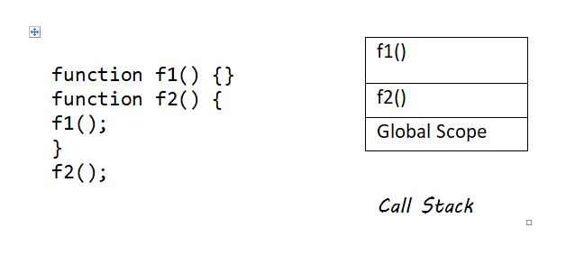

# Day 06 - 40 Days of JavaScript

## **🎯 Goal of This Lesson**

- ✅ What Will We Learn
- ✅ What is Function
- ✅ Define a Function
- ✅ Invoking a Function
- ✅ Function as Expression
- ✅ Parameter and Argument
- ✅ Default Parameters
- ✅ Rest parameter
- ✅ Nested Functions
- ✅ Callback Function
- ✅ Pure Function
- ✅ Higher Order Function
- ✅ Arrow Function
- ✅ IIFE
- ✅ Call Stack
- ✅ Recursion
- ✅ Task and Wrap Up


## **👩‍💻 🧑‍💻 Assignment Tasks**

<br/><br/>

## ✅ 1. Write a Function to Convert Celsius to Fahrenheit
Create a function celsiusToFahrenheit(celsius) that converts a temperature from Celsius to Fahrenheit.
Formula: (Celsius * 9/5) + 32 = Fahrenheit

```js
function celsiusToFahrenheit(params) {
  const fahrenheit = (params * 9/5) + 32;
  console.log(`${params} Celsius = ${fahrenheit} Fahrenheit`);
}
celsiusToFahrenheit(31); // 31 Celsius = 87.8 Fahrenheit
```

<br/><br/>

## ✅ 2. Create a Function to Find the Maximum of Two Numbers
Write a function findMax(num1, num2) that returns the larger of the two numbers. It should work for negative numbers as well.

```js
function maxNumber(num1, num2) {
  num1 > num2 ? console.log(`${num1} is max number`) : console.log(`${num2} is max number`);
}
maxNumber(-10, -99); // -10 is max number
```

<br/><br/>

## ✅ 3. Function to Check if a String is a Palindrome
Create a function isPalindrome(str) that checks if a given string is a palindrome (reads the same forward and backward). You can not use any string function that we have not learned in the series so far.

```js
function checkPalindrome(word) {
  let isPalindrome;
  const reversedWord = word.split("").reverse();  
  for (let i = 0; i < reversedWord.length; i++) {
    word[i] === reversedWord[i] ? isPalindrome = true :  isPalindrome = false;
  }
  console.log(isPalindrome);
}
checkPalindrome("abcdcba"); //Output: true
```

<br/><br/>

## ✅ 4. Write a Function to Find Factorial of a Number
- Create a function factorial(n) that returns the factorial of n.
- Example 5! = 5 * 4 * 3 * 2 * 1

```js
function findFactorial(n) {
  if(n === 0 || n === 1) {
    return 1;
  }
  return n * findFactorial(n - 1);
}
console.log(findFactorial(5)); // 120
```

<br/><br/>

## ✅ 5. Write a function to Count Vowels in a String
Write a function countVowels(str) that counts the number of vowels (a, e, i, o, u) in a given string.

```js
function countVowels(str) {
  const vowels = str.split("").filter(letter => ["a", "e", "i", "o", "u"].includes(letter));
  const counts = {};
  vowels.forEach(vowel => {
    counts[vowel] = (counts[vowel] || 0) + 1;
  });
  console.log(counts);
}
countVowels("abcdea"); // {a: 2, e: 1}
```

<br/><br/>

## ✅ 6. Write a Function to Capitalize the First Letter of Each Word in a Sentence
Write a function capitalizeWords(sentence) that takes a sentence and capitalizes the first letter of each word. You can use the toUpperCase() method of string to convert the lowercase to uppercase.

```js
function capitalize(sentence) {
  const wordArr = sentence.split(" ");
  const capitalizeWord = [];
  wordArr.forEach(word => {
    capitalizeWord.push(word[0].toUpperCase() + word.substr(1));
  });
  console.log(capitalizeWord.join(" "));
}
capitalize("lorem ipsum dolor sit."); // Lorem Ipsum Dolor Sit.
```

<br/><br/>

## ✅ 7. Use an IIFE to Print “Hello, JavaScript!”
Write an IIFE that prints "Hello, JavaScript!" to the console. Here the Second word must be supplied using paramneter and argument.

```js
(function(param) {
  console.log(`Hello, ${param}`); //Hello, JavaScript!
})("JavaScript!"); 
```

<br/><br/>

## ✅ 8. Create a Simple Callback Function
Write a function greet(name, callback), where callback prints a message using the name parameter.

```js
function callCallBack(func) {
  const greeting = func();
  console.log(greeting + " John!"); // Hello John!
}
callCallBack(function() {
  return "Hello";
})
```

<br/><br/>

## ✅ 9. Create Call Stack Execution Diagram for this flow

```js
function f1() {}
function f2() {
  f1();
}
f2();
```

[]

Please find the task assignments in the [Task File](./task.md).