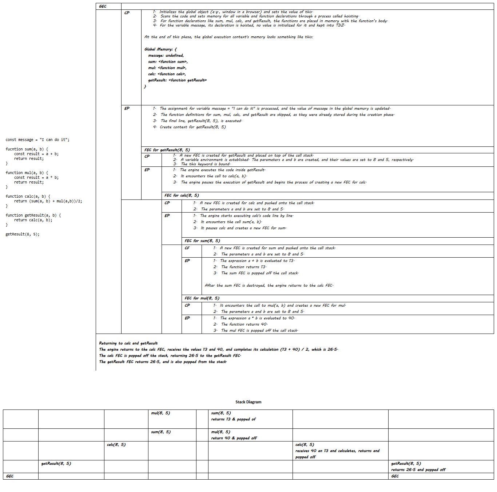

# Day 08 - 40 Days of JavaScript

## **🎯 Goal of This Lesson**

- ✅ Welcome to Module 2
- ✅ Why Execution Context
- ✅ Lexical Environment
- ✅ Execution Context
- ✅ Global Execution Context
- ✅ Function Execution Context
- ✅ GEC and FEC With Complex Examples
- ✅ Memory Management With Call Stack and Heap
- ✅ Task for YOU!

## **👩‍💻 🧑‍💻 Assignment Tasks**


## ✅ 1. Draw the Execution Context Diagram of the follwoing code and share as explained below:

```js
const message = "I can do it";

fucntion sum(a, b) {
    const result = a + b;
    return result;
}

function mul(a, b) {
    const result = a * b;
    return result;
}
function calc(a, b) {
    return (sum(a, b) + mul(a,b))/2;
}

function getResult(a, b) {
    return calc(a, b);
}

getResult(8, 5);
```

- Create the GEC and FEC with CP and EP flow
- Create the Stack and Heap Flow
- Create the Stack Diagram
- Create a Readme file with all the above diagram and share on Discord.

<br/><br/>

[]("Video")

Please find the task assignments in the [Task File](./task.md).