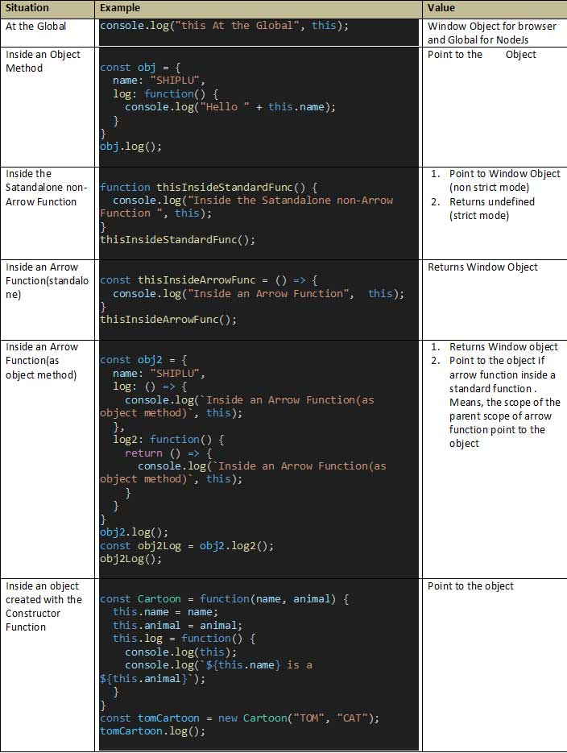

# Day 13 - 40 Days of JavaScript

## **🎯 Learnings of This Lesson**

- ✅ Welcome to Day 13 
- ✅ What is “this”? | The "this" is a keyword in many programming languages. It is used with the object, and it has different value or outcome in different situations.
- ✅ this in Global | In Global context "this" returns Window object.
- ✅ Implicit Binding | The "this" inside a method that binds to its own object while calling the method like someObject.someMethod() is called Implicit Binding.
- ✅ this Inside an Arrow Function | Inside arrow function, "this" goes out of its lexical scope and returns the Window object.
- ✅ Explicit Binding | It is used to bind the object and method together when there is no relation between the method and the object.
- ✅ The call() method | We can use the call() method along with the function and pass as many arguments as we want.
- ✅ The apply() method | The apply() method works like the call() method, but the difference is we can pass arguments as an array.
- ✅ The bind() method | The bind() method doesn't get executed instantly. We can store the bind() method in a variable and invoke it at later point of time when it's needed.
- ✅ The new Keyword and this Keyword | Both the keywords are used in the constructor function.
- ✅ A Quick Recap
- ✅ Interview Questions and Answers
- ✅ Task and What’s Next?


## **👩‍💻 🧑‍💻 Assignment Tasks**

## 1. Create a markdown table of two columns, `situation` and `value`. Now add the rows for every situations from bello list and the value of `this` in that situation. Please cover the following situations

- At the Global
- Inside an Object Method
- Inside the Satandalone non-Arrow Function
- Inside an Arrow Function(standalone)
- Inside an Arrow Function(as object method)
- Inside an object created with the Constructor Function

### Solutions ✔



<br/><br/>

## 2. What is the problem here? Fix it to log the correct name and explain the fix

```js
const user = {
  name: "tapaScript",
  greet: () => {
    console.log(`Hello, ${this.name}!`);
  },
};

user.greet();
```

### Solutions ✔

```js
// Here it will print undefined because arrow function doesn't have any this. It goes out of the parent's lexical scope and get window object but window object has no name property. To fix this we can either use standard function method or keep the arrow function inside a regular function method.
const user = {
  name: "tapaScript",
  /*greet: () => {
    console.log(`Hello, ${this.name}!`);
  },*/
  greet: function() {
    console.log(`Hello, ${this.name}!`);
  },
};
user.greet(); // Hello tapaScript
```

<br/><br/>


## 3. Can you explain what is the problem here and fix the issue to log the correct name?

```js
const obj = {
  name: "Tom",
  greet: function () {
    console.log(`Hello, ${this.name}!`);
  },
};

const greetFn = obj.greet;
greetFn();
```

### Solutions ✔

```js
// greetFn doesn't have any relation with the obj object, that's why using call() method of explicit binding we can fix this. 
const obj = {
  name: "Tom",
  greet: function () {
    console.log(`Hello, ${this.name}!`);
  },
};
const greetFn = obj.greet;
greetFn.call(obj); // Hello Tom
```

<br/><br/>

## 4. What is the problem with the following code? Why isn't it logging the name correctly?

```js
const user = {
  name: "Alex",
  greet: function () {
    function inner() {
      console.log(`Hello, ${this.name}!`);
    }
    inner();
  },
};

user.greet();
```

### Solutions ✔

```js
const user2 = {
  name: "Alex",
  greet: function () {
    function inner() {      
      console.log(`Hello, ${this.name}!`);
    }
    inner();
  },
};
user2.greet(); //undefined. Because inner() is not a method of user2 object. It's just a standalone function inside greet method, so here this keyword is returning window object in non strict mode and undefined in strict mode
```

<br/><br/>

## 5. Create a `Sports` constructor function that takes `name` and `number of players` as arguments and assigns them using `this` keyword. Then, create two sports instances and log their details

### Solutions ✔

```js
const Sports = function(name, numOfPlayer) {
  this.name = name;
  this.numOfPlayer = numOfPlayer;
  this.log = function() {
    console.log(`There are ${this.numOfPlayer} players in a ${this.name} team`);
  }
}
const footBall = new Sports("Football", 11);
footBall.log(); //There are 11 players in a Football team
const basketBall = new Sports("Basketball", 5);
basketBall.log(); // There are 5 players in a Basketball team
```

<br/><br/>

## 6. Can you attach the car1's `describe()` method to car2 object? Give all possible solutions that you can think of

```js
const car1 = {
  brand: "Audi",
  model: "A8",
  describe: function () {
    console.log(`This car is a ${this.brand} ${this.model}.`);
  },
};

const car2 = {
  brand: "BMW",
  model: "X1",
};
```

### Solutions ✔

```js
const car1 = {
  brand: "Audi",
  model: "A8",
  describe: function () {
    console.log(`This car is a ${this.brand} ${this.model}.`);
  },
};
const car2 = {
  brand: "BMW",
  model: "X1",
};
const carFn = car1.describe;
// Solution 1
carFn.call(car2);
// Solution 2
carFn.apply(car2);
// Solution 3
const anotherCarFn = car1.describe.bind(car2);
anotherCarFn();
```

<br/><br/>

## 7. What will be the output of the following code and why?

```js
const person = {
  name: "Charlie",
  sayHello: function () {
    console.log(this.name);
  },
  sayHelloArrow: () => {
    console.log(this.name);
  },
};

person.sayHello();
person.sayHelloArrow();
```

Options are:

- A: "Charlie" and "Charlie"
- B: "Charlie" and undefined
- C: "Charlie" and "" (empty string)
- D: undefined and "Charlie"

### Solutions ✔

```js
const person = {
  name: "Charlie",
  sayHello: function () {
    console.log(this.name);
  },
  sayHelloArrow: () => {
    console.log(this.name);
  },
};
person.sayHello(); // Charlie. Inside sayHello() method this is pointing to the person object because of implicit binding
person.sayHelloArrow(); // undefined. this keyword inside sayHelloArrow() method has no effect. It goes up of parent's lexical scope and returns undefined in non strict mode and window object in strict mode
```
<br/><br/>
Please find the task assignments in the [Task File](./task.md).