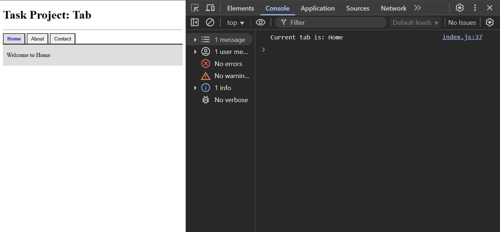

# Day 19 - 40 Days of JavaScript - JavaScript Events

## **🎯 Goal of This Lesson**

- ✅ What Will We Learn Today?
- ✅ What is an Event?
- ✅ Event Handling in markup
- ✅ Event Handling in Script
- ✅ addEventListener
- ✅ removeEventListener
- ✅ Handling Multiple Listeners
- ✅ DOM Content Loaded
- ✅ Anatomy of Event Object
- ✅ Event Bubbling
- ✅ Event Capturing
- ✅ Event Delegation
- ✅ Stop Propagation
- ✅ Preventing Defaults
- ✅ Custom Events
- ✅ Project - FAQ
- ✅ The Task and Wrap Up


## **👩‍💻 🧑‍💻 Assignment Tasks**

### 1. Create a Dynamic Tabbed Interface

Build a clean, accessible tab component where clicking on a tab header displays the corresponding tab content. It mimics real-world use like dashboards, profile settings, or pricing plans.

### Functional Requirements

- ✅ Clicking a tab title shows the corresponding content.
- ✅ Only one tab content is visible at a time.
- ✅ The active tab should have a visual highlight.
- ✅ Add a keyboard shortcut: pressing 1, 2, or 3 switches to that tab.

    Example:

    ```js
    document.addEventListener("keydown", (e) => {
        if (e.key === "1") switchToTab(1);
        if (e.key === "2") switchToTab(2);
        if (e.key === "3") switchToTab(3);
        });
    ```

- ✅ Use event delegation to handle tab clicks.
- ✅ Use classList to manage active state.
- ✅ Use a custom event to broadcast when a tab is changed (log tab name to console).
- ✅ Use stopPropagation() if needed during advanced control.

### Basic HTML Structure

```html
<div class="tabs">
  <div class="tab-headers">
    <button class="tab active" data-tab="1">Home</button>
    <button class="tab" data-tab="2">About</button>
    <button class="tab" data-tab="3">Contact</button>
  </div>
  <div class="tab-contents">
    <div class="content active" data-tab="1">Welcome to Home</div>
    <div class="content" data-tab="2">About us page here.</div>
    <div class="content" data-tab="3">Contact info displayed here.</div>
  </div>
</div>
```


```js
const tabs = document.querySelector(".tabs");

tabs.addEventListener("click", e => {
  if(e.target.tagName === "BUTTON") {
    const button = e.target;
    switchToTab(button);
    broadcastTabName(button);
  }
});

document.addEventListener("keydown", (e) => {
  const buttons = document.querySelectorAll("button.tab")
  if (e.key === "1") {
    switchToTab(buttons[0]);
    broadcastTabName(buttons[0]);
  };
  if (e.key === "2")  {
    switchToTab(buttons[1]);
    broadcastTabName(buttons[1]);
  };
  if (e.key === "3") {
    switchToTab(buttons[2]);
    broadcastTabName(buttons[2]);
  }
});

function broadcastTabName(button) {
  const event = new CustomEvent("loggedTabName", {
    detail: {
      tab_name: button.innerText
    }
  });
  document.dispatchEvent(event);
}

document.addEventListener("loggedTabName", e => {
  console.log(`Current tab is: ${e.detail.tab_name}`);
});

function switchToTab(button) {
  removeActiveClassFromButton();
  button.classList.add("active");

  const tabId = button.dataset.tab;

  const contents = document.querySelectorAll(".content");

  contents.forEach(content => {
    if(content.dataset.tab === tabId) {
      content.classList.add("active");
    } else {
      content.classList.remove("active");
    }
  })
}

function removeActiveClassFromButton() {
  const buttons = document.querySelectorAll("button.active");
  buttons.forEach(btn => btn.classList.remove("active"));
}
```


[]("Rendered Image")

Please find the task assignments in the [Task File](./task.md).