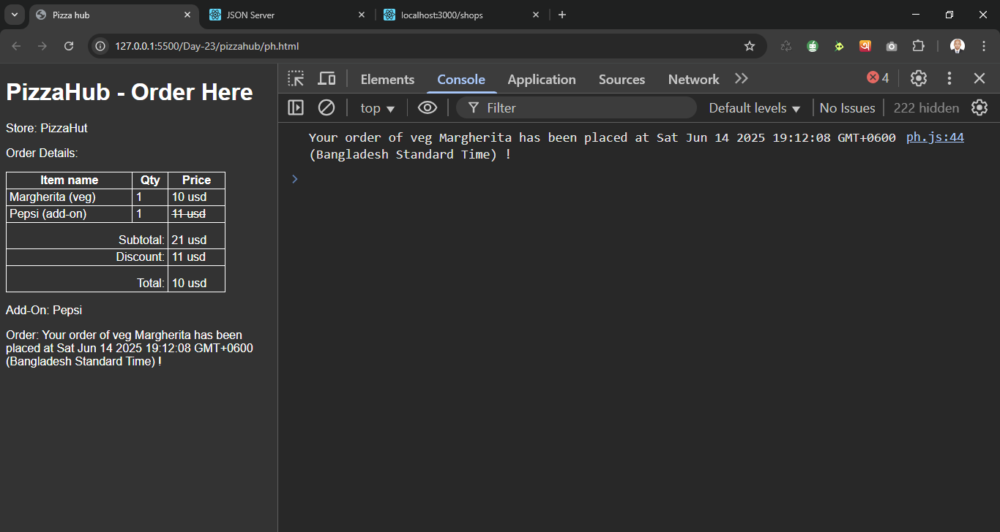

# PizzaHub 

[query.js](./lib/query.js) file.
```js
function query(endpoint, options) {
  return new Promise((resolve, reject) => {
    setTimeout(() => {
      fetch(`http://localhost:3000/${endpoint}`, options)
        .then(response => {
          if(!response.ok) {
            throw new Error(`HTTP Error: ${response.status}`);
          }
          return response.json();
        })
        .then(resolve)
        .catch(reject)
    }, 2000);
  });
}
```


[ph.js](./ph.js) file.
```js
let pizzaInfo, beverageInfo;

function getShopIds() {
  const endpoint = "shops";
  return query(endpoint);
}

function getPizzaList(shopId) {
  const endpoint = `pizzas?shopId=${shopId}`;
  document.getElementById("store").textContent = `Store: ${shopId}`;
  return query(endpoint);  
}

function getMyPizzaWithAddOn(pizzaList, type, name) {

  const myPizza = pizzaList.find(pizza => pizza.type === type && pizza.name === name);
  pizzaInfo = myPizza;

  const endpoint  = `beverages?pizzaId=${myPizza.id}`;
  return query(endpoint);
}


function performOrderPizza(result) {
  beverageInfo = result;
  
  const endpoint = `api/order`
  const options = {
    method: "POST",
    headers: {
      "Content-type": "application/json"
    },
    body: JSON.stringify({
      pizzaId: result.pizzaId,
      beverageId: result.id
    })
  }
  return query(endpoint, options);
}

function confirmMessage(type, name, createdAt) {
  const text = `Your order of ${type} ${name} has been placed at ${new Date(createdAt)} !`
  console.log(text);
  document.getElementById("order").innerText = `Order: ${text}`;
}

function showOrderInDOM(pizzaInfo, beverageInfo) {
  document.getElementById("itemName").textContent = `${pizzaInfo.name} (${pizzaInfo.type})`;
  document.getElementById("itemPrice").textContent = `${pizzaInfo.price} ${pizzaInfo.unit}`;

  document.getElementById("addOnName").textContent = `${beverageInfo.name} (add-on)`;
  document.getElementById("addOnPrice").innerHTML = `<del>${beverageInfo.price} ${beverageInfo.unit}</del>`;
  document.getElementById("add-on").textContent = `Add-On: ${beverageInfo.name}`;

  document.getElementById("overallSubtotal").textContent = `${parseInt(pizzaInfo.price) + parseInt(beverageInfo.price)} ${pizzaInfo.unit}`;
  document.getElementById("discountSubtotal").textContent = `${parseInt(beverageInfo.price)} ${pizzaInfo.unit}`;
  document.getElementById("totla").textContent = `${(parseInt(pizzaInfo.price) + parseInt(beverageInfo.price) - parseInt(beverageInfo.price))} ${pizzaInfo.unit}`;
}

function OrderPizza(type, name) {
  getShopIds() //returns shop id promise and resolve by next then
    .then(shopIds => {
      let shopId;
      for(key in shopIds) {
        shopId = shopIds[key] === false ? key : key;
      }
      // console.log(shopId); // PizzaHut
     return getPizzaList(shopId) //returns shop promise by id and resolve by next then
    })
    .then(pizzaList => getMyPizzaWithAddOn(pizzaList, type, name))
    .then(pizzaWithAddOn => performOrderPizza(pizzaWithAddOn[0]))
    .then(order => confirmMessage(type, name, order.createdAt))
    .then(() => showOrderInDOM(pizzaInfo, beverageInfo))
    .catch(error => console.error(error))
}

// call orderPizza
OrderPizza("veg", "Margherita")
```


