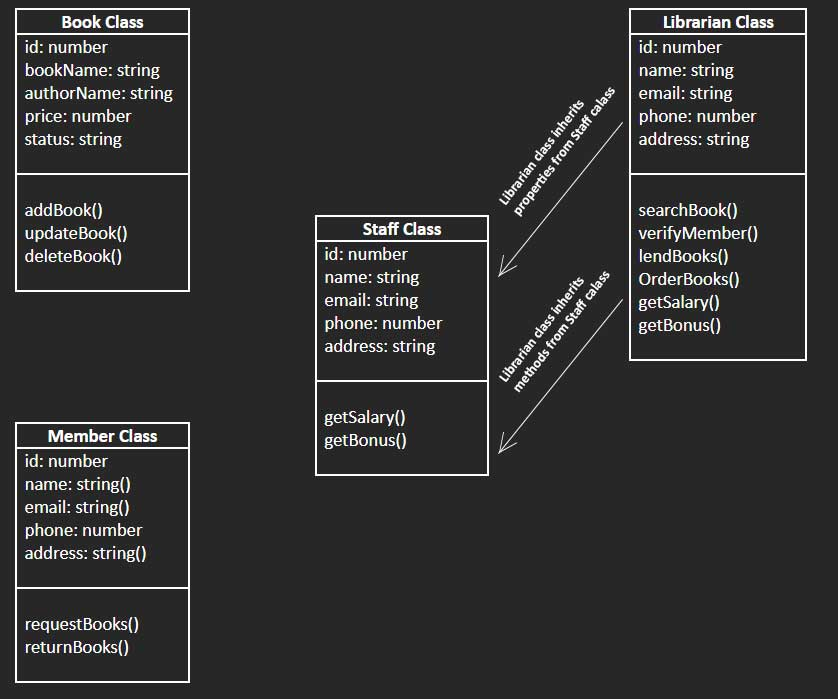

# Day 29 - 40 Days of JavaScript - OOP Concepts

## **🎯 Goal of This Lesson**

- ✅ Welcome to Module 5
- ✅ Things to Learn Today
- ✅ Objects
- ✅ Classes
- ✅ Functions
- ✅ Object Oriented Programming(OOP)
- ✅ Real-world Examples of OOP
  - ✅ Abstraction
  - ✅ Encapsulation
  - ✅ Inheritance
  - ✅ Polymorphism
  - ✅ Composition
- ✅ Quick Recap

## **👩‍💻 🧑‍💻 Assignment Tasks**

 

## ✅ 1. Identify Real-Life Objects with OOP Concepts

Pick any 3 real-life objects (e.g., smartphone, bicycle, school), and for each:

- List at least 3 properties (attributes).
- List at least 3 behaviors (methods).
- Write which OOP principle each property or behavior best represents and why.

 

>### Hospital  
>  -> number_of_bed: number(hide)  
>  -> doctors: number (hide)  
>  -> nurses: number (hide)  
>  -> administration(): void (private)  
>  -> get_doctors_list(): void (public)  
>  -> take_admission(): void (public)  
>  
>In the above example, the "number_of_bed()" property represents the Abstraction principle because people don't need to know how many beds there are in the hospital. Only administrative authority should know that information. And the same goes for the "doctors" and "nurses" properties. The "administration()" method should be private because the end user should not know about the administrative works, but the "get_doctors_list()" and the "take_admission()" methods should be kept public because people need to know the doctor's list to get visited and get admitted to the hospital.

 

>### Bicycle  
>  -> wheels: number (public)  
>  -> seats: number (public)  
>  -> gears: number (hidden)  
>  -> start_paddling(): void (public)  
>  -> break(): void (public)  
>  -> change_gear(): void (public)  
>  
> In bicycle object's example represents the abstraction OOP concept. Here the wheels and the seats are public property, but the gears property is hidden, because user doesn't need to know that how many gears or how the gears works. Here all the methods like "start_paddling()", " break()" and "change_gear()" are the public methods.

 

> ### Smartphone  
>  -> display: number (public)  
>  -> camera: number (public)  
>  -> usb: number (hidden)  
>  -> make_call(): void (public)  
>  -> cancel_call(): void (public)  
>  -> plugging_usb(): void (public)  
>  
> In Smartphone object's example represents the abstraction and the polymorphism OOP concept all together.  
> * Polymorphism: The "display", "camera" and the "usb" is the separate single unit or object which has been integrated to make a smartphone object  
> * Abstraction: All the methods like "make_call()", "cancel_call()" and "plugging_usb()" are the interface of the smartphone, because nobody need to know how a smartphone make a call or cancel a call or how the usb circuit works. User just need the functionality of making a call, canceling a call or plug in/out usb.  

  

## ✅ 2. Draw a Diagram of an OOP Modeled System

Create a diagram (hand-drawn or digital) of a system like:

- A library system (Books, Members, Staff, etc.)
- Or a fast-food restaurant system (Orders, Menus, Employee)

In the diagram Show classes/objects 
- Arrows to represent relationships like inheritance or composition
- Indicate which class encapsulates what data and methods

 

> ### Diagram
>

  

## ✅ 3. Explain OOP Principles with Human Analogies

Write your own analogy (non-code) to explain each of the 5 OOP principles:

- Abstraction
- Encapsulation
- Inheritance
- Polymorphism
- Composition

It must be unique (not from the class), and explain how that analogy relates to programming.

 

> ### Abstraction
> <b>Analogy:</b> Suppose I need to see the outside world; that's why I have my eyes, but I don't need to know how eyes work to see. My body hides the complex functionalities of eyesight and gives me only eyes to see.  
> <b>In Programming:</b> Abstraction is the OOP principle that hides the complexity of a system and exposes only the simple interface to the user.  

> ### Encapsulation
> <b>Analogy:</b> I have the blood protected inside the vein of my body. I cannot see or touch it, but if in some cases I need blood, then I have to bring the blood with the help of a syringe.  
> <b>In Programming:</b> There is always some protected data in a system that no one gets access to. If that data is needed to access, then there will be some methods to access it. In the above analogy, I need to bring the blood with the help of a syringe.  

> ### Inheritance
> <b>Analogy:</b> Alongside the biological and mental features of mine, there are some features in me that I have inherited from my parents.  
> <b>In Programming:</b> The child classes can inherit the properties from their parent class. This OOP principle helps to reduce code duplication and gives the reusability of code writing.  

> ### Polymorphism
> <b>Analogy:</b> The word work, when applied to me, means I do a job or task; when the word goes for my brain that time, it means I am thinking; when it goes for my legs, it means I'm walking or running. All using the same word but in different contexts.  
> <b>In Programming:</b> The same method or function name behaves differently based on the object it's acting on. This helps with flexibility and reusability in the code.  

> ### Composition
> <b>Analogy:</b> Instead of my inherited complexion from my parents, I can change this to a different complexion by surgery. Like this, I can customize many things that I have inherited from my parents.  
> <b>In Programming:</b> A class can be composed with the other individual classes instead of inheritance. This principle makes code reusable, modular, and easy to maintain.  

  

## ✅ 4. Compare OOP vs Functional Thinking

Choose a simple system (e.g., a To-Do app or Alarm Clock) and:

- Describe how you’d design it using OOP (with objects)
- Describe how you’d design it using Functional Programming (with functions)

You don’t have to write code — just use words and bullets. 

 

> ### To-Do app using OOP
> - Need to create classes like Task
> - The object maintain its own property. A Task object store its information like title, isComplete state etc.
> - Methods belong to object like task.addNewTask() or task.markAsComplete()  

> ### To-Do app using Function
> - Task is a plain object { id, name, isComplete }
> - Only plain data would be used (like arrays and objects) and pure functions to operate on them.
> - Variables will be changed through function calls, like filter(), map(), reduce().
 

  

## ✅ 5. Object vs Class vs Function – Explain Like a Teacher

Imagine you’re teaching a 10-year-old:

- What is a Class?
- What is an Object?
- What is a Function?

Use simple language, drawings, or emojis if needed.

 

> ### What is a Class?
> - A class is a plan or a blueprint that defines an object's characteristics and behavior. And using this blueprint, different objects or instances can be created.
> - Whenever an object is needed to be created first, we have to make it clear in our minds what the properties and methods should be needed, and according to the demand, a class can be created.

> ### What is a Object?
> - An object is such a thing that has some characteristics and behaviors, and that is called an object.
> - In the programming paradigm, an object will have some properties (characteristics) and methods (behavior).
> - An object can be formed by the key and value pairs and by the function, which is called a method.

> ### What is a Function?
> - Function defines how an object will behave and act. A function inside an object is called a method.

 

Please find the task assignments in the [Task File](./task.md).

