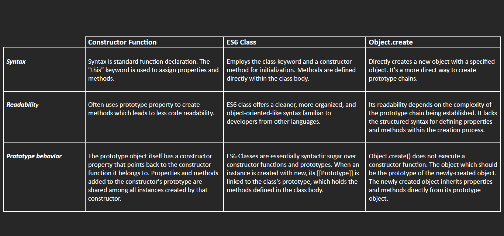

# Day 31 - 40 Days of JavaScript - Prototype & Prototype Chain

## **🎯 Goal of This Lesson**

- ✅ What Can You Expect
- ✅ JavaScript Object Literals Pattern
- ✅ Ways To Extract Values From Objects
- ✅ JavaScript Object and The const Keyword
- ✅ JavaScript Functions vs Methods
- ✅ The Constructor Function Pattern
- ✅ Composing Objects and References
- ✅ Object Prototypes
- ✅ Prototype Chain
- ✅ Constructor Function Visually
- ✅ The "prototype" Property
- ✅ The "prototype" Visually
- ✅ Prototype To Save Memory
- ✅ Prototype Chain(Lookup) Visually
- ✅ JavaScript Class Pattern
- ✅ JavaScript Class Inheritance
- ✅ The Object.create() Pattern
- ✅ How To Get Prototype Of An Object
- ✅ How To Set An Object Prototype
- ✅ The Closing Notes

<br/>

## **👩‍💻 🧑‍💻 Assignment Tasks**

<br/>

## ✅ 1. Create a Simple Prototype Chain

- Define a base object animal with a method eat.
- Create another object dog that inherits from animal using Object.create.
- Call eat from dog and explain how the prototype chain resolves it.

<br />

```js
    const animal = {
        name: "Tiger",
        eat: function () {
        console.log(`The animal ${this.name} eats meat...`);
        }
    }

    const dog = Object.create(animal);
    dog.name = "Dog";
    dog.eat(); //Output: The animal Dog eats meat...

    // Explanation: When the dog object gets created with the Object.create(animal) method, the object dog inherits the animal property's features, which are stored inside a prototype variable. As prototype is the mechanism of accessing features from one object to another, here the dog object can have all the properties and methods from the animal.
```

<br /><br />

## ✅ 2. Build a Custom Constructor Function

- Create a constructor function Book(title, author).
- Add a method getDetails() to the prototype of Book.
- Instantiate two books and show they share the method from the prototype.

<br />

```js
    function Book(title, author) {
        this.title = title;
        this.author = author;
    }

    Book.prototype.getDetails = function () {
        console.log(`The book "${this.title}" is by ${this.author}`)
    };

    const harryPotter = new Book("Harry Potter", "JK Rowling");
    harryPotter.getDetails() //Output: The book "Harry Potter" is by JK Rowling

    const theOldManAndTheSea = new Book("The Old Man and the Sea", "Ernest Hemingway" )
    theOldManAndTheSea.getDetails(); //Output: The book "The Old Man and the Sea" is by Ernest Hemingway
```

<br/><br/>

## ✅ 3. Compare Object Creation Patterns

Create three objects using:

- Object literals
- Constructor functions
- Object.create

Add similar methods and compare how inheritance works in each pattern.

<br />

```js
    // Object literals
    const employee1 = {
        id: crypto.randomUUID(),
        name: "Azlan",
        email: "azlan@email.com",
        department: function() {
        console.log(`Mr. ${this.name} works in Development department.`);
        },
        info: function() {
        console.log(`Employee name: ${this.name} - email: ${this.email}`);
        }
    }

    // The object created by object literals by default doesn't have any inheritance feature, but we can achieve that using some methods like Object.create(). But object.prototype is not applicable to the particular object that has been created by object literals.

    // employee1.prototype.infos = function() {}

    const employee2 = Object.create(employee1);
    employee2.name = "Rebel";
    employee2.email = "rebel@email.com";
    employee2.info()
    
    // In the above example, employee2 was created by Object.create(), and it inherits all the features from employee1.


    // Constructor functions
    function Student(name, grade) {
        this.name = name;
        this.grade = grade;
    }

    Student.prototype.info = function () {
        console.log(`${this.name} study in grade ${this.grade}`);
    }
    // The object created by the constructor function has support for the Student.prototype. And using this property, the student constructor can have a method in its prototype and share that method among the child objects. Examples are below.

    const john = new Student("John", 9);
    john.info();

    const doe = new Student("Doe", 10);
    doe.info();
```

<br /><br />

## ✅ 4. Simulate a Real-World Inheritance Chain

- Simulate a real-life hierarchy: Person → Student → GraduateStudent.
- Each level should add its own methods or properties using prototypes.
- Show how a GraduateStudent can access methods from both Student and Person.

<br />

```js
    function Person(name, age) {
        this.name = name;
        this.age = age;
    }
    Person.prototype.info = function () {
        console.log(`Person name ${this.name} and age ${this.age}.`);
    }
    
  
    class Student extends Person {
        constructor(name, age, grade) {
        super(name, age);
        this.grade = grade;
        }
    }
    Student.prototype.logGrade = function () {
        console.log(`${this.name} study in grade ${this.grade}`);
    }
    

    class GraduateStudent extends Student {
        constructor(name, age, grade, nextCourse) {
        super(name, age, grade);
        this.nextCourse = nextCourse;
        }
    }

    GraduateStudent.prototype.logNextCourse = function() {
        console.log(`${this.name} is now going to achieve the next ${this.nextCourse} course`);
    }

    const graduateStudent = new GraduateStudent("Alex", 26, "Graduate", "Post Graduate");
    
    //method inherits from Person
    graduateStudent.info(); //Output: Person name Alex and age 26.

    // method inherits from Student
    graduateStudent.logGrade(); //Output: Alex study in grade Graduate

    // Own method
    graduateStudent.logNextCourse() //Output: Alex is now going to achieve the next Post Graduate course
```

<br/><br/>

## ✅ 5. Object.create vs Class vs Constructor Function

- Implement the same User entity using:
  - Constructor Function
  - ES6 Class
  - Object.create
- Write a summary comparing syntax, readability, and prototype behavior.

<br/>

```js
    // Object.create
    {
        const user1 = {
            username: "username",
            password: "password",
            info: function() {
            console.log(`Username: ${this.username} - Password: ${this.password}`);
            }
        }

        console.log(user1);

        const user2  = Object.create(user1);
        console.log(user2);
    }
```

```js
    // Constructor Function
    {
        function User(username, password) {
            this.username = username;
            this.password = password;
        }

        User.prototype.info = function() {
            console.log(`Username: ${this.username} - Password: ${this.password}`);
        }

        const user = new User("username", "password");
        console.log(user);
    }
```

```js
    // ES6 Class
    {
        class User {
            constructor(username, password) {
                this.username = username;
                this.password = password;
            }
            info () {
                console.log(`Username: ${this.username} - Password: ${this.password}`);
            }
        }

        const user = new User("username", "password");
        console.log(user);
    }
```

<br/>

>
>### 1. Syntax
> #### Constructor Function:
> - Syntax is standard function declaration. The "this" keyword is used to assign properties and methods.
>
> #### ES6 Class:
> - Employs the class keyword and a constructor method for initialization. Methods are defined directly within the class body.
>
> ### Object.create:
> - Directly creates a new object with a specified object. It's a more direct way to create prototype chains.

<br/>

>### 2. Readability
> #### Constructor Function:
> - Often uses prototype property to create methods which leads to less code readability.
>
> #### ES6 Class:
> - ES6 class offers a cleaner, more organized, and object-oriented-like syntax familiar to developers from other languages.
>
> #### Object.create:
> - Its readability depends on the complexity of the prototype chain being established. It lacks the structured syntax for defining properties and methods within the creation process.

<br/>

> ### 3. Prototype behavior
> #### Constructor Function:
> - The prototype object itself has a constructor property that points back to the constructor function it belongs to. Properties and methods added to the constructor's prototype are shared among all instances created by that constructor.
>
> #### ES6 Class:
> - ES6 Classes are essentially syntactic sugar over constructor functions and prototypes. When an instance is created with new, its [[Prototype]] is linked to the class's prototype, which holds the methods defined in the class body.
>
> #### Object.create:
> - Object.create() does not execute a constructor function. The object which should be the prototype of the newly-created object. The newly created object inherits properties and methods directly from its prototype object.
>

<br/>

### Comparison Table


Please find the task assignments in the [Task File](./task.md).